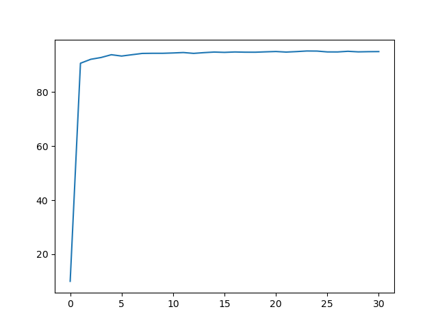

# MNIST Classifier From Scratch in Haskell
See the demo [here](https://ttesmer.github.io/haskell-mnist/).

Handwritten digit classifier trained on the classic [MNIST dataset](http://yann.lecun.com/exdb/mnist/). Written using one [linear algebra package](https://hackage.haskell.org/package/hmatrix) from scratch in Haskell.
Current architecture of the network is implemented  according to the first two and a half chapters of the [Neural Networks and Deep Learning](http://neuralnetworksanddeeplearning.com/) book. Specifically, the [quadratic loss function](https://en.wikipedia.org/wiki/Loss_function#Quadratic_loss_function), [cross-entropy loss function](https://en.wikipedia.org/wiki/Cross_entropy) and mini-batch [stochastic gradient descent](https://en.wikipedia.org/wiki/Stochastic_gradient_descent) are implemented.

## Prerequisites
The repo uses [BLAS](http://www.netlib.org/blas/) and [LAPACK](http://www.netlib.org/lapack/) through [hmatrix](https://hackage.haskell.org/package/hmatrix) for basic linear algebra operations. You will need to install both of them:

### On Linux:
```bash
$ sudo apt-get install libblas-dev liblapack-dev
```

### On MacOS:

Stack does not yet fully support the arm64 architecture. If you happen to use ZSH, it will give a segmentation fault. To solve this, use Cabal instead of Stack:
```bash
$ cabal v2-build 
$ cabal v2-exec hmnist-exe
```


### On Windows:
See [here](https://icl.cs.utk.edu/lapack-for-windows/lapack/).

## Run
Code runs using [Stack](https://docs.haskellstack.org/en/stable/README/). First clone the repository, then run
```bash
$ stack build
$ stack exec hmnist-exe
```
Note that you will have to run it from */path/to/repo/* because it gets the current directory and looks for the MNIST data in *data/mnist_dataset/* from the current directory.

## Code
Everything interesting is in the [src/Network.hs](src/Network.hs) file. The order of functions in the Network.hs file is (sort of) from most to least important; the functions are organized into blocks of *arithmetic functions*, *helper functions* (which should probably be renamed to *utility functions*, though this may be misleading) and *data processing functions*. Above them are the functions that train the network. 

You can see everything above the *data processing functions* as being the code that is also in the Neural Networks and Deep Learning book. Everything below that is either a peculiarity of Haskell that I could not implement in another way (i.e. the *helper functions*) or the equivalent to the *mnist_loader.py* function that Daniel Nielsen uses in the book (i.e. the *data processing functions*).

 Currently it is very difficult to understand the code, even if you fundamentally understand how the mini-batch SGD works mathematically or in other programming languages. This is because I tried to write it by *folding* and *scanning* over lists to do the computations. Additionally, the abstractions of the functions are a bit odd. The *updateBatches*, *train* and *test* functions should be reduced in the size of number of arguments they take since this unnecessarily obfuscates the code. The current state is not final; I will keep refactoring and optimizing the code.

## Performance
At first it took 20 minutes to train a single epoch, compared to ~20 seconds in the referenced book, but this number was reduced after I learned about [profiling](https://www.tweag.io/blog/2020-01-30-haskell-profiling/) in Haskell and was able to find the bottlenecks. Most bottlenecks were eliminated once their [laziness](https://github.com/hasura/graphql-engine/pull/2933#discussion_r328821960) was changed to strict evaluation. Optimizing the code and switching from the matrix package to hmatrix to enable BLAS usage reduced the time per epoch to ~10 seconds. The entire thing now takes about 5 minutes to train on my machine.

However, looking at [htop](https://en.wikipedia.org/wiki/Htop), you can see that the parallelization is not working as well as it is in NumPy. In the future it might be interesting to look into how NumPy works with multithreading. Most people say that it is all thanks to BLAS, but you can see that if you run `python` and open `htop`, there's only one thread running. Now, if you import NumPy, instantly all threads are used. Haskell allows multithreading with the `-threaded` [GHC option](https://downloads.haskell.org/~ghc/latest/docs/html/users_guide/phases.html#ghc-flag--threaded), but it uses multithreading in a [rather odd way](https://stackoverflow.com/questions/5847642/haskell-lightweight-threads-overhead-and-use-on-multicores/5849482#5849482) and I do not know how this multithreading works with that of BLAS (it might have something to do with the [Foreign Function Interface Multithreading](https://downloads.haskell.org/~ghc/8.2.1/docs/html/users_guide/ffi-chap.html#multi-threading-and-the-ffi), though I have yet to find an actual solution because hmatrix is doing this all under the hood).

Though there are a lot of things I have not figured out and the code is suboptimal in multiple ways, these problems have been great sources for learning about memory usage, multithreading, concurrency, parallelism etc.

**UPDATE:** I noticed that `hmatrix` only uses multithreading if the matrices are very big. Although the network is fairly large, with the base settings it does not use multithreading. If you change it to 34 epochs or higher, it will start using multithreading. This multithreading happens using the C headers and thus is under the hood of GHC. I turned the multithreading thread off for now in GHC and it runs much smoother (less GC time). As for performance, it runs in about a second per epoch now using fully matrix-based backpropagation. It's even faster than the algorithm of the book now (even if that one also uses fully matrix-based backpropagation).

## Results
After 30 epochs of training (~~5 minutes~~ 33 seconds) with the base settings, the network classifies about 95% of the 10000 testing images correctly. There are many more things that could be done to improve these results (E.g. learning rate annealing/scheduling, different cost functions such as cross entropy (✅), and other forms of tuning hyperparameters), and I will keep adding those adjustments to this repository as I go through more chapters of the referenced [book](http://neuralnetworksanddeeplearning.com/).

```bash
$ stack exec hmnist-exe
Epoch #0: 9067/10000 (90.67906790679068%)
Epoch #1: 9213/10000 (92.13921392139214%)
Epoch #2: 9279/10000 (92.7992799279928%)
Epoch #3: 9382/10000 (93.82938293829383%)
Epoch #4: 9333/10000 (93.33933393339335%)
Epoch #5: 9382/10000 (93.82938293829383%)
Epoch #6: 9430/10000 (94.30943094309431%)
Epoch #7: 9435/10000 (94.35943594359436%)
Epoch #8: 9435/10000 (94.35943594359436%)
Epoch #9: 9447/10000 (94.47944794479449%)
Epoch #10: 9463/10000 (94.63946394639464%)
Epoch #11: 9432/10000 (94.32943294329434%)
Epoch #12: 9459/10000 (94.5994599459946%)
Epoch #13: 9481/10000 (94.81948194819482%)
Epoch #14: 9469/10000 (94.6994699469947%)
Epoch #15: 9484/10000 (94.84948494849485%)
Epoch #16: 9476/10000 (94.76947694769477%)
Epoch #17: 9475/10000 (94.75947594759477%)
Epoch #18: 9489/10000 (94.8994899489949%)
Epoch #19: 9501/10000 (95.01950195019502%)
Epoch #20: 9480/10000 (94.8094809480948%)
Epoch #21: 9498/10000 (94.989498949895%)
Epoch #22: 9520/10000 (95.2095209520952%)
Epoch #23: 9517/10000 (95.17951795179518%)
Epoch #24: 9486/10000 (94.86948694869487%)
Epoch #25: 9485/10000 (94.85948594859485%)
Epoch #26: 9509/10000 (95.0995099509951%)
Epoch #27: 9488/10000 (94.88948894889488%)
Epoch #28: 9495/10000 (94.95949594959497%)
Epoch #29: 9498/10000 (94.989498949895%)
stack exec hmnist-exe  582.30s user 115.11s system 216% cpu 5:22.54 total
```
The last line tells us it took 5 minutes and 23 seconds to run the code. As you can see above that, the network peaked at ~95.2% accuracy during the 22nd epoch (it counts from zero, so actually it's the 23rd epoch). 

**(Note: it now actually uses fully matrix-based backpropagation and only takes 33 seconds for 30 epochs)**

The result also shows that the accuracy jumps from 10% (random) to 90% after just the first epoch. After that, however, it grows much, much slower and basically reaches its local minimum (of the loss function) at about 94% accuracy. This is because of the quadratic loss function. With the [cross-entropy](https://en.wikipedia.org/wiki/Cross_entropy) however, the learning slow-down isn't as bad and so it tops out at ~96.8% accuracy, a 1.6% increase.

This can be visualized as follows:



### UPDATE: Results with Cross Entropy instead of Quadratic Loss
```bash
Running cross-entropy mini-batch SGD with η of 0.50 and 100 neurons:
Epoch 0: 93.46%
Epoch 1: 94.77%
Epoch 2: 95.22%
Epoch 3: 95.14%
Epoch 4: 95.81%
Epoch 5: 95.99%
Epoch 6: 96.00%
Epoch 7: 95.98%
Epoch 8: 96.47%
Epoch 9: 96.41%
Epoch 10: 96.45%
Epoch 11: 96.50%
Epoch 12: 96.53%
Epoch 13: 96.37%
Epoch 14: 96.40%
Epoch 15: 96.63%
Epoch 16: 96.63%
Epoch 17: 96.76%
Epoch 18: 96.70%
Epoch 19: 96.69%
Epoch 20: 96.79%
Epoch 21: 96.75%
Epoch 22: 96.75%
Epoch 23: 96.67%
Epoch 24: 96.62%
Epoch 25: 96.81%
Epoch 26: 96.68%
Epoch 27: 96.70%
Epoch 28: 96.79%
Epoch 29: 96.83%
Epoch 30: 96.61%
```

## Possible Additions/Changes/TODO
- [Refactoring/style guide](https://github.com/tibbe/haskell-style-guide/blob/master/haskell-style.md) and [here](https://github.com/input-output-hk/cardano-node/blob/master/STYLE.md).
- [Accelerate package](https://hackage.haskell.org/package/accelerate)
- [Repa arrays](https://hackage.haskell.org/package/repa) and [Repa algorithms](https://hackage.haskell.org/package/repa-algorithms-3.4.1.3)
- See [RESOURCES](RESOURCES.md)
